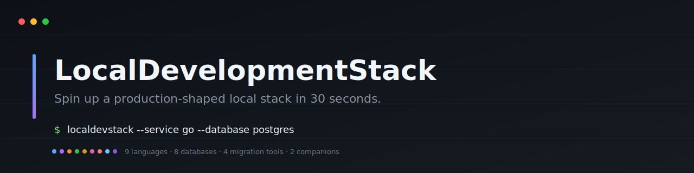
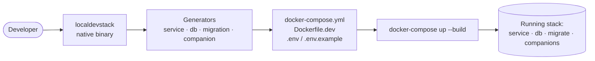

<p align="center">
  
</p>

<h1 align="center">LocalDevelopmentStack</h1>

<p align="center">
  <strong>Spin up a production-shaped local stack in 30 seconds.</strong><br>
  One command generates a Dockerised service + database + hot-reload. Nine languages, eight databases, no JVM required.
</p>

<p align="center">
  <a href="https://github.com/krishgok/LocalDevelopmentStack/actions/workflows/release.yml"></a>
  <a href="https://github.com/krishgok/localdevstack/releases/latest"></a>
  <a href="LICENSE"></a>
  
  <a href="#install"></a>
</p>

<p align="center">
  <code>brew install krishgok/localdevstack/localdevstack</code> &nbsp;·&nbsp; <code>localdevstack --service go --database postgres</code>
</p>

<!--
  The demo GIF is produced from docs/assets/demo.tape. After running
  `vhs docs/assets/demo.tape` once and committing the resulting GIF,
  uncomment the block below to embed it.
-->
  <p align="center">
    
  </p>


---

## Before / After

<table>
<tr>
<th align="left" width="50%">Before — hand-roll the stack</th>
<th align="left" width="50%">After — one command</th>
</tr>
<tr>
<td valign="top">

```yaml
# docker-compose.yml — write from scratch
services:
  service:
    build:
      context: ./service
      dockerfile: Dockerfile.dev
    ports: ["8080:8080"]
    environment:
      DATABASE_URL: postgresql://...
    volumes: [".:/app"]
    depends_on:
      db: { condition: service_healthy }
  db:
    image: postgres:16
    # ... env, ports, volume, healthcheck...
```

Plus: write `Dockerfile.dev` with the right hot-reload tool, manage `.env`, add `.gitignore` rules, debug compose healthcheck timing — repeat for every new project.

</td>
<td valign="top">

```bash
localdevstack \
  --service go \
  --database postgres \
  --output ./my-api
```

```text
my-api/
├── service/
│   ├── main.go
│   └── Dockerfile.dev
├── docker-compose.yml
├── .env  /  .env.example
└── .gitignore
```

```bash
cd my-api && docker-compose up --build
curl http://localhost:8080/health
# → {"status":"ok"}
```

</td>
</tr>
</table>

---

## Features

|  |  |
|---|---|
| ✦ **Hot-reload, everywhere** | Edit source, see it live — no rebuild |
| ✦ **9 service generators** | Go · Node · Python · Rust · Java · Spring Boot · .NET · PHP · Ruby |
| ✦ **8 database generators** | Postgres · MySQL · MongoDB · CockroachDB · Redis · MariaDB · SQL Server · Elasticsearch |
| ✦ **Optional migrations** | Flyway · Liquibase · migrate-mongo · golang-migrate |
| ✦ **Optional companions** | MailHog (SMTP catcher) · MinIO (S3-compatible store) |
| ✦ **Native binary** | No JVM, no Docker-in-Docker — one self-contained executable |

---

## Quickstart

### Install

<details><summary><strong>macOS / Linux — Homebrew</strong></summary>

```bash
brew tap krishgok/localdevstack
brew install localdevstack
```

> Pre-built bottles for **macOS arm64**, **Linux x64**, and **Windows x64**. Intel macOS users: clone the repo and run `./gradlew nativeCompile` (requires GraalVM 21).

</details>

<details><summary><strong>Windows — Scoop</strong></summary>

```powershell
scoop bucket add localdevstack https://github.com/krishgok/localdevstack
scoop install localdevstack
```

</details>

<details><summary><strong>macOS / Linux — curl</strong></summary>

```bash
curl -fsSL https://raw.githubusercontent.com/krishgok/localdevstack/main/scripts/install.sh | bash
```

</details>

<details><summary><strong>Windows — PowerShell</strong></summary>

```powershell
irm https://raw.githubusercontent.com/krishgok/localdevstack/main/scripts/install.ps1 | iex
```

</details>

### First stack in three steps

```bash
# 1. Generate
localdevstack --service go --database postgres --output ./my-api --name my-api

# 2. Run
cd my-api && docker-compose up --build

# 3. Verify
curl http://localhost:8080/health
# → {"status":"ok"}
```

Edit any file under `service/` — the watcher inside the container picks it up and reloads automatically.

**Two modes:**

```bash
# New service     — generates source code + Dockerfile.dev + docker-compose.yml
localdevstack --service go --database postgres --output ./my-api

# Existing service — auto-detects language, generates Dockerfile.dev + docker-compose.yml
localdevstack --existing-dir ./my-existing-api --database postgres
```

→ Full walkthrough: **[New service](docs/usage-new-service.md)** · **[Existing service](docs/usage-existing-service.md)**

---

## Architecture



`LocalDevStackCli` dispatches via three registry maps — `SERVICES`, `DATABASES`, `COMPANIONS` — and runs each generator into the chosen output directory. Volume-mounted source means **edits hot-reload without rebuilding**.

---

## Who it's for

- **Solo developers prototyping** — skip the docker-compose boilerplate; get a working stack on a new project in 30 seconds.
- **Teams onboarding new hires** — commit `docker-compose.yml` + `.env.example`; new joiners run one command and have the full local stack.
- **Platform / DevEx teams** — standardise local environments across repos without writing a custom CLI or yet-another-internal-template.

---

## Showcase

### Service support — 9 languages, one CLI

<p>
  
  
  
  
  
  
  
  
  
</p>

Every generated service exposes `GET /health` → `{"status":"ok"}` and ships with the right hot-reload tooling baked in — `air` for Go, `nodemon` for Node, `uvicorn --reload` for Python, `cargo-watch` for Rust, `dotnet watch run` for .NET, and so on.

→ **[Sentinel files, framework details, full table](docs/usage-new-service.md)**

### Database support — 8 engines, zero config

<p>
  
  
  
  
  
  
  
  
</p>

Every database container ships with a healthcheck and injects its connection string into your service via a single environment variable. Your code reads one variable; the same code works locally and in production.

→ **[Per-language connection examples](docs/db-connections.md)**

### Migrations — opt-in, one flag

| `--migration`     | Tool             | Best for                                                              |
|-------------------|------------------|-----------------------------------------------------------------------|
| `flyway`          | Flyway 10        | Versioned SQL on Postgres, MySQL, MariaDB, SQL Server, CockroachDB    |
| `liquibase`       | Liquibase 4.27   | Richer changelog format, multiple SQL dialects                        |
| `migrate-mongo`   | migrate-mongo 11 | MongoDB collection migrations                                         |
| `golang-migrate`  | migrate v4       | One tool, six engines (incl. MongoDB)                                 |

```bash
localdevstack --service go --database postgres --migration flyway
docker-compose run --rm migrate     # manual run — uses the `migrations` compose profile
```

→ **[docs/migrations.md](docs/migrations.md)**

### Companions — drop-in dev services

| Companion   | What you get                                                                                                  |
|-------------|---------------------------------------------------------------------------------------------------------------|
| **MailHog** | SMTP catcher + web UI on `:8025`. Capture outgoing mail. Auto-injects `SMTP_HOST`, `SMTP_PORT`.               |
| **MinIO**   | S3-compatible object store + console on `:9001`. Auto-injects `S3_ENDPOINT`, `S3_ACCESS_KEY`, `S3_SECRET_KEY`. |

```bash
localdevstack --service node --database postgres --with mailhog,minio
```

→ **[docs/companions.md](docs/companions.md)**

### Power-user flags

|                          |                                                                                                       |
|--------------------------|-------------------------------------------------------------------------------------------------------|
| **Env file management**  | `.env` (gitignored) + `.env.example` (commit-safe) written on every invocation                        |
| **Dry-run mode**         | `--dry-run` prints the resolved plan and would-be file list without touching the filesystem           |
| **Multi-database**       | One DB per invocation by default; copy the second `db:` block into your existing compose file         |
| **`--force`**            | Overwrite existing migrations / compose files when regenerating into the same directory               |
| **`--port`**             | Pin the service port (default auto-selects 8080 → 8081 → 8082 if lower ports are occupied)            |

→ **[docs/advanced.md](docs/advanced.md)**

---

## Roadmap

- **More companions** — Redis-as-cache, Prometheus + Grafana, OpenTelemetry collector + Jaeger
- **Vector databases** — pgvector, Qdrant, Weaviate
- **Bigger bets** — Kubernetes output, multi-service composition, interactive `init` wizard

→ Full list: **[docs/roadmap.md](docs/roadmap.md)**

---

## Contributing & support

- **Issues / feature requests** → [github.com/krishgok/localdevstack/issues](https://github.com/krishgok/localdevstack/issues)
- **Pull requests** → see [CONTRIBUTING.md](CONTRIBUTING.md)
- **Code of Conduct** → see [CODE_OF_CONDUCT.md](CODE_OF_CONDUCT.md)
- **Disclaimers & limitations** → see [docs/disclaimers.md](docs/disclaimers.md)

Licensed under the [Apache License, Version 2.0](LICENSE).
